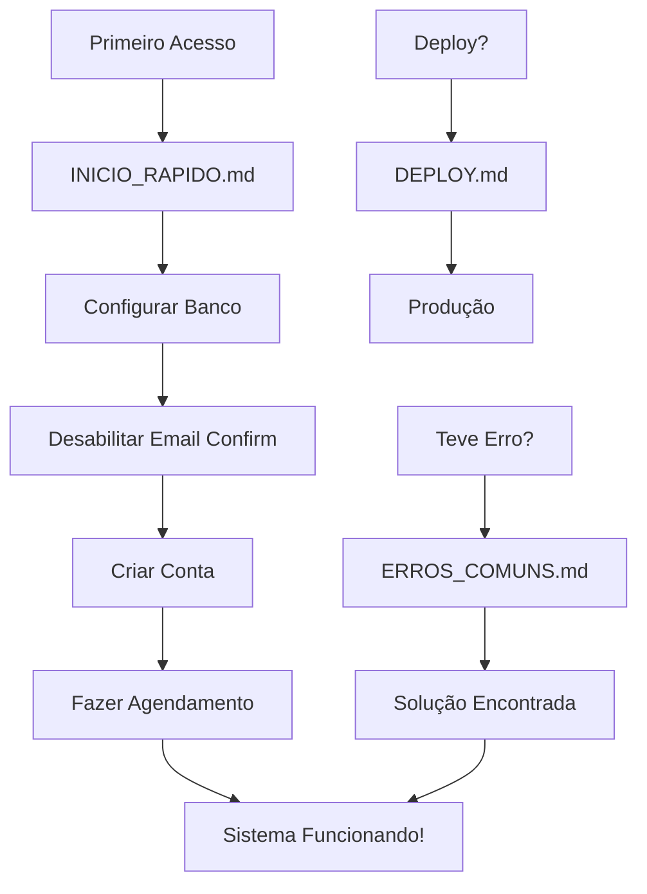

# 📚 Índice de Documentação - Lemon's Car

## 📖 Guias Disponíveis

### 🚀 Para Começar

1. **[INICIO_RAPIDO.md](./INICIO_RAPIDO.md)** ⚡
   - Configuração em 5 minutos
   - Passo a passo simplificado
   - Checklist de configuração
   - **Comece por aqui!**

2. **[README.md](./README.md)** 📘
   - Visão geral do sistema
   - Funcionalidades principais
   - Estrutura do projeto
   - Tecnologias utilizadas

### 🔧 Configuração e Setup

3. **[supabase/SETUP.md](./supabase/SETUP.md)** 🗄️
   - Configuração detalhada do banco de dados
   - Scripts SQL completos
   - Políticas de segurança (RLS)
   - Criação de primeiro admin

4. **[supabase/migrations/001_initial_setup.sql](./supabase/migrations/001_initial_setup.sql)** 📜
   - Script SQL pronto para executar
   - Criação de todas as tabelas
   - Índices e otimizações

### 📖 Guias Detalhados

5. **[GUIA_COMPLETO.md](./GUIA_COMPLETO.md)** 📚
   - Tutorial completo passo a passo
   - Todas as funcionalidades explicadas
   - Casos de uso
   - Personalização avançada
   - Estrutura do banco de dados

### 🚢 Deploy e Produção

6. **[DEPLOY.md](./DEPLOY.md)** 🚀
   - Guia de deploy para produção
   - Vercel, Netlify, Cloudflare Pages
   - Configuração de ambiente
   - Checklist de segurança
   - Integração com gateway de pagamento
   - Custos estimados

### 🐛 Solução de Problemas

7. **[ERROS_COMUNS.md](./ERROS_COMUNS.md)** 🔧
   - Erros mais frequentes
   - Soluções rápidas
   - Troubleshooting detalhado
   - Como obter ajuda
   - **Consulte quando tiver problemas!**

---

## 🎯 Por Onde Começar?

### Se você é novo no sistema:
```
1. INICIO_RAPIDO.md (5 min)
2. README.md (visão geral)
3. Acesse /admin e configure
```

### Se quer entender tudo:
```
1. README.md
2. GUIA_COMPLETO.md
3. supabase/SETUP.md
```

### Se teve um erro:
```
1. ERROS_COMUNS.md
2. Console do navegador (F12)
3. Logs do Supabase
```

### Se vai fazer deploy:
```
1. DEPLOY.md
2. Checklist de segurança
3. Testes em produção
```

---

## 📂 Estrutura de Arquivos

```
/
├── INICIO_RAPIDO.md          ⚡ Comece aqui!
├── README.md                 📘 Visão geral
├── GUIA_COMPLETO.md          📚 Tutorial completo
├── DEPLOY.md                 🚀 Produção
├── ERROS_COMUNS.md           🔧 Troubleshooting
├── DOCUMENTACAO.md           📖 Este arquivo
│
├── supabase/
│   ├── SETUP.md              🗄️ Setup do banco
│   └── migrations/
│       └── 001_initial_setup.sql
│
├── components/               🎨 Componentes React
├── contexts/                 🔄 Contextos React
├── utils/                    🛠️ Utilitários
└── styles/                   💅 Estilos CSS
```

---

## 🎨 Recursos Visuais

### URLs Principais

| Recurso | URL | Documento |
|---------|-----|-----------|
| Site Principal | `/` | README.md |
| Painel Admin | `/admin` | GUIA_COMPLETO.md |
| Área do Cliente | `/dashboard` | GUIA_COMPLETO.md |
| Setup Banco | `/admin` → Setup Banco | supabase/SETUP.md |

### Credenciais Padrão

```
Painel Admin:
- Usuário: admin
- Senha: lemonscar2026
```

---

## 📊 Fluxo de Uso



---

## 🔍 Busca Rápida

### Procurando por...

**Autenticação:**
- Login de clientes: `GUIA_COMPLETO.md` → "Autenticação Completa"
- Login admin: `README.md` → "Painel Administrativo"
- Erro de email: `ERROS_COMUNS.md` → "Email not confirmed"

**Banco de Dados:**
- Configuração: `supabase/SETUP.md`
- Tabelas: `GUIA_COMPLETO.md` → "Estrutura do Banco"
- Erros: `ERROS_COMUNS.md` → "Table not found"

**Checkout:**
- Funcionalidades: `README.md` → "Sistema de Checkout"
- Integração: `DEPLOY.md` → "Gateway de Pagamento"
- Erros: `ERROS_COMUNS.md` → "Checkout não funciona"

**Personalização:**
- Cores: `README.md` → "Personalização"
- Serviços: `GUIA_COMPLETO.md` → "Gerenciamento"
- Textos: Painel Admin `/admin` → Configurações

**Deploy:**
- Vercel: `DEPLOY.md` → "Opção A"
- Netlify: `DEPLOY.md` → "Opção B"
- Segurança: `DEPLOY.md` → "Checklist"

---

## 💡 Dicas de Leitura

### Iniciante
1. ⭐ INICIO_RAPIDO.md (essencial)
2. README.md (recomendado)
3. ERROS_COMUNS.md (se tiver problemas)

### Intermediário
1. GUIA_COMPLETO.md
2. supabase/SETUP.md
3. DEPLOY.md

### Avançado
1. Código fonte dos componentes
2. Políticas RLS no Supabase
3. Integrações customizadas

---

## 🆘 Precisa de Ajuda?

### Passo a Passo:
1. Identifique o problema
2. Consulte `ERROS_COMUNS.md`
3. Verifique console (F12)
4. Revise configuração
5. Consulte documentação específica

### Ordem de Prioridade:
1. 🔧 ERROS_COMUNS.md
2. 📘 README.md
3. 📚 GUIA_COMPLETO.md
4. 🗄️ supabase/SETUP.md
5. 🚀 DEPLOY.md

---

## 📝 Atualizações

Este documento índice serve como ponto central de navegação. Todos os documentos estão interconectados e podem ser consultados conforme necessário.

**Última atualização:** Sistema completo implementado

---

## ✅ Checklist de Documentação

- [x] Guia rápido criado
- [x] README completo
- [x] Guia detalhado
- [x] Setup do banco
- [x] Guia de deploy
- [x] Solução de erros
- [x] Índice de documentação

---

**💡 Sugestão:** Marque esta página nos favoritos para acesso rápido!

**🍋 Lemon's Car - Documentação Completa**
